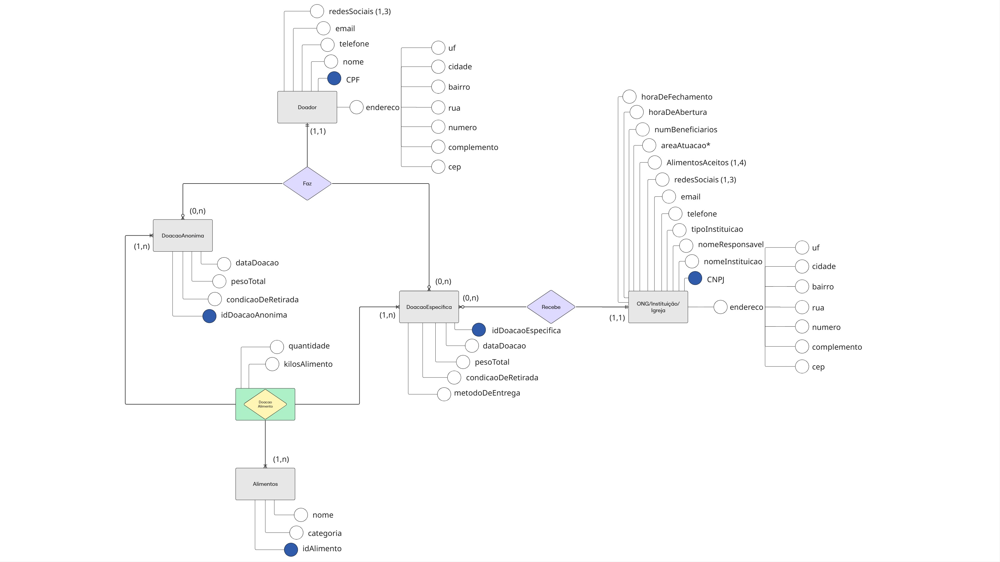
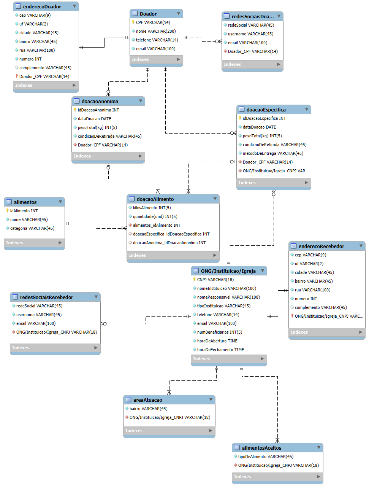

# AlimentaAção

O AlimentAção é uma plataforma web que visa conectar potenciais doadores de alimento à instituições que necessitam dessas doações para realizar ações solidárias. 

## Introdução
Este documeonto tem por objetivo reunir os principais documentos produzidos referentes ao banco de dados da aplicação. O intuito disso é proporcionar transparência e organização quanto ao que acreditamos ser a maneira mais adequada de contextualizar, diagramar e modelar os dados associados à problemática na qual o projeto AlimentaAção, bem como o produto de software a ele vinculado, está inserido.

## Documentos criados

### MER
O Modelo Entidade-Relacionamento (MER) é uma abordagem conceitual usada no projeto de banco de dados para representar entidades, seus atributos e relacionamentos. Isso permite visualizar como os dados estão organizados e como as entidades se relacionam no sistema de informações. O MER é a base conceitual sobre a qual os Diagramas Entidade-Relacionamento (DER) são criados para representar graficamente essa estrutura.
#### Entidades:
- doador
- enderecoDoador
- redesSociaisDoador
- doacaoAnonima
- doacaoEspecifica
- doacaoAlimento
- alimentos
- ong/instituicao/igreja
- enderecoRecebedor
- redesSociaisRecebedor
- areaAtuacao
- alimentosAceitos

#### Descrição das entidades:
- doador (cpf, nome, telefone, email)
- enderecoDoador (cep, uf, cidade, bairro, rua, numero, complemento, doador_cpf)
- redesSociaisDoador (redeSocial, username, email, doador_cpf)
- doacaoAnonima (idDoacaoAnonima, dataDoacao, pesoTotal(kg), condicaoDeRetirada)
- doacaoEspecifica (idDoacaoEspecifica, dataDoacao, pesoTotal(kg), condicaoDeRetirada, metodoDeEntrega, doador_cpf, ong/instituicao/igreja_cnpj)
- doacaoAlimento (kilosAlimento, quantidade(und), alimentos_idAlimento, doacaoAnonima_idDoacaoAnonima, doacaoEspecifica_idDoacaoEspecifica)
- alimentos (idAlimento, nome, categoria)
- ong/instituicao/igreja (cnpj, nomeInstituicao, nomeResponsavel, tipoInstituicao, telefone, email, numBeneficiarios, horaDeAbertura, horaDeFechamento)
- enderecoRecebedor (cep, uf, cidade, bairro, rua, numero, complemento, ong/instituicao/igreja_cnpj)
- redesSociaisRecebedor(redeSocial, username, email, ong/instituicao/igreja_cnpj)
- areaAtuacao (bairro, ong/instituicao/igreja_cnpj)
- alimentosAceitos (tipoDeAlimento, ong/instituicao/igreja_cnpj)

#### Relacionamentos
- Doador tem EnderecoDoador
  - Doador possui apenas um EnderecoDoador, e um EnderecoDoador é de apenas um Doador
  - Cardinalidade: (1:1)
- Doador possui RedeSociaisDoador
  - Doador possui zero ou várias RedesSociaisDoador, e RedesSociaisDoador tem apenas um Doador
  - Cardinalidade: (1:n)
- Doador faz DoacaoAnonima
  - Doador faz zero ou várias DoacaoAnonima, e DoacaoAnonima é feita por apenas um doador
  - Cardinalidade: (1:n)
- Doador faz DoacaoEspecifica
  - Doador faz zero ou várias DoacaoEspecifica, e DoacaoEspecifia é feita por apenas um doador
  - Cardinalidade: (1:n)
- DoacaoAnonima possui DoacaoAlimento
  - DoacaoAnonima possui uma ou várias DoacaoAlimento, e DoacaoAlimento participar de nenhuma ou uma DoacaoAnonima
  - Cardinalidade (1:n)
- DoacaoEspecifica possui DoacaoAlimento
  - DoacaoEspecifica possui uma ou várias DoacaoAlimento, e DoacaoAlimento participar de nenhuma ou uma DoacaoEspecifica
  - Cardinalidade (1:n)
- DoacaoAlimento possui Alimentos
  - DoacaoAlimento possui apenas um Alimentos, e Alimentos participam de uma ou várias doacaoAlimento
  - Cardinalidade (1:n)
- DoacaoEspecifica possui ONG/Instituicao/Igreja
  - DoacaoEspecifica possui apenas uma ONG/Instituicao/Igreja, e ONG/Instituicao/Igreja recebe nenhuma ou várias DoacaoEspecifica
  - Cardinalidade (1:n)
- ONG/Instituicao/Igreja tem EnderecoRecebedor
  - ONG/Instituicao/Igreja possui apenas um EnderecoRecebedor, e um EnderecoRecebedor é de apenas um ONG/Instituicao/Igreja
  - Cardinalidade: (1:1)
- ONG/Instituicao/Igreja possui RedeSociaisRecebedor
  - ONG/Instituicao/Igreja possui zero ou várias RedeSociaisRecebedor, e RedeSociaisRecebedor tem apenas um ONG/Instituicao/Igreja
  - Cardinalidade: (1:n)
- ONG/Instituicao/Igreja possui uma AreaAtuacao
  - ONG/Instituicao/Igreja possui uma ou várias AreaAtuacao, e AreaAtuacao é de apenas uma ONG/Instituicao/Igreja
  - Cardinalidade: (1:n)
- ONG/Instituicao/Igreja possui alimentosAceitos
  - ONG/Instituicao/Igreja possui um ou vários alimentosAceitos, e alimentosAceitos são aceitos por apenas uma ONG/Instituicao/Igreja
  - Cardinalidade: (1:n)

### DER
O Diagrama Entidade-Relacionamento (DER) é uma representação gráfica amplamente utilizada no projeto de bancos de dados. Ele descreve as entidades (objetos), seus atributos (características) e os relacionamentos entre as entidades. Os retângulos representam as entidades, as elipses indicam os atributos e as linhas conectam as entidades para mostrar como elas se relacionam. O DER é uma ferramenta fundamental para visualizar e planejar a estrutura de um banco de dados antes da implementação, ajudando a definir como os dados são armazenados e acessados.

### DLD
O Diagrama Lógico de Dados (DLD) é uma representação gráfica que ilustra a estrutura lógica de um banco de dados. Nesse diagrama, são exibidas informações cruciais, como os tipos de atributos associados a cada entidade, bem como as chaves estrangeiras e restrições, como a chave única (unique key). Seu propósito fundamental é fornecer uma representação estruturada e específica da maneira como o banco de dados deve ser implementado. Em resumo, o DLD funciona como uma representação visual que orienta a implementação efetiva do banco de dados.

### Dicionário de dados

#### Doador
|Atributo|Propriedades do Atributo|Tipo de Dado|Tamanho|Descrição|
|--------|------------------------|------------|-------|---------|
|CPF|Chave Primária, Obrigatório| Varchar|14|CPF do doador|
|Nome|Obrigatório|Varchar|200|Nome do doador|
|Telefone|Obrigatório|Varchar|14|Telefone do doador|
|Email|Chave exclusiva, Obrigatório|Varchar|100|Email do doador|

#### EnderecoDoador
|Atributo|Propriedades do Atributo|Tipo de Dado|Tamanho|Descrição|
|--------|------------------------|------------|-------|---------|
|CEP|Obrigatório|Varchar|9|CEP da rua do endereco do Doador|
|UF|Obrigatório|Varchar|2|Unidade Federativa do endereco do Doador|
|Cidade|Obrigatório|Varchar|45|Cidade do endereco do Doador|
|Bairro|Obrigatório|Varchar|45|Bairro do endereco do Doador|
|Rua|Obrigatório|Varchar|100|Rua do endereco do Doador|
|Numero|Obrigatório|INT||Número da residência do Doador|
|Complemento||Varchar|45|Complemento do endereco do Cliente|
|Doador_CPF|Chave Primária, Chave estrangeira, Obrigatório|Varchar|45|CPF do Doador dono do endereco|

#### RedesSociaisDoador
|Atributo|Propriedades do Atributo|Tipo de Dado|Tamanho|Descrição|
|--------|------------------------|------------|-------|---------|
|RedeSocial|Obrigatório|Varchar|45|Rede Social|
|Username|Chave exclusiva, Obrigatório|Varchar|45|Perfil do Doador na Rede Social|
|Email|Obrigatório|Varchar|100|Email do Perfil da Rede Social|
|Doador_CPF|Chave estrangeira, Obrigatório|Varchar|14|CPF do Doador|
